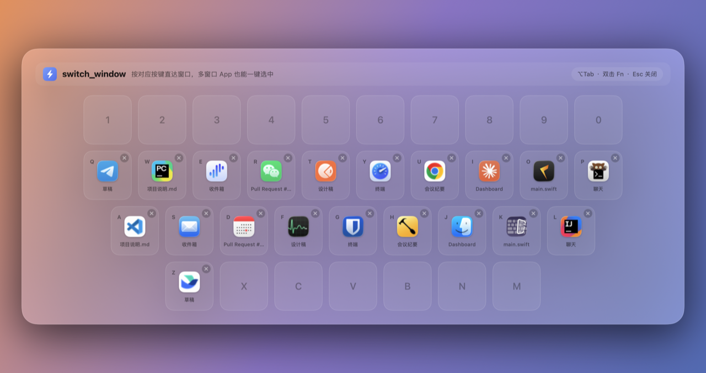

# switch_window

[](https://github.com/KysonGeek/switch_app/actions/workflows/build.yml)

> 一个 macOS 菜单栏小工具：按下快捷键唤出**键盘布局**的浮层，每个按键对应一个打开的窗口，**按键即跳转**。专治 `⌘Tab` 切 App 时多窗口 App 选不到具体窗口的痛点。



UI 风格参考了 [浮光](https://vkr.me/)（见 `assets/demo.webp`）：毛玻璃面板 + 键盘网格 + App 图标。

---

## 为什么

macOS 自带的 `⌘Tab` 只能切到 **App**。一个 App 开了多个窗口（多个 Finder、多个浏览器窗口、多个代码项目…）时，它没法直接定位到你想要的那一个。

switch_window 把**所有窗口**铺到一张键盘上，一次按键直达任意窗口。

## 功能特性

- **两种唤起方式**：`⌥Tab`（Option+Tab）或 **双击 Fn / 🌐(Globe) 键**
- 列出所有常规 App 的标准窗口（含已最小化的窗口）
- 每个键显示 **App 图标 + 窗口标题**，同一个 App 的多个窗口也能区分
- **按键** 或 **鼠标点击** 即跳转：自动激活 App、置顶窗口、还原最小化
- 每个键右上角带 **✕ 关闭按钮**，不离开浮层即可关掉窗口
- **稳定排序**：窗口按 App 名称 → 窗口标题 → 屏幕位置 确定顺序，**同一窗口每次都落在同一个键**（不再随机跳动）
- **按键优先级**：窗口按 中排(home) → 上排 → 下排 → 数字行 的顺序占用最好按的键
- `Esc`、点击浮层之外、或失去焦点都会自动关闭
- 菜单栏 agent，不占 Dock；冷启动经过优化（见 [性能](#性能)）

## 环境要求

- macOS 13 (Ventura) 及以上
- Xcode / Swift 6 工具链（`swift build` 可用即可）

## 安装与构建

```bash
./setup_signing.sh        # 仅首次：创建本地签名证书（让重编后不丢辅助功能权限，见下文）
./make_icon.sh            # 仅首次/改图标后：生成 Resources/AppIcon.icns
./build_app.sh            # 编译 + 打包 + 签名，产出「switch_window.app」
open "switch_window.app"  # 启动，菜单栏出现 ▱ 图标
```

> 仓库已包含 `Resources/AppIcon.icns`，所以可跳过 `make_icon.sh` 直接构建。
> `setup_signing.sh` 是可选的（不跑则自动回退到 ad-hoc 签名），但**强烈建议运行**。

## 授予辅助功能权限

枚举和切换其他 App 的窗口依赖 macOS 辅助功能（Accessibility）API：

1. 启动后系统会弹出授权提示；或手动打开
   **系统设置 ▸ 隐私与安全性 ▸ 辅助功能**
2. 勾选 **switch_window**
3. 按 `⌥Tab` 或双击 Fn 即可使用

## 使用方法

| 操作 | 说明 |
|------|------|
| `⌥Tab` / 双击 `Fn` | 唤起或关闭浮层 |
| 按对应字母/数字键 | 跳转到该窗口 |
| 鼠标点击按键 | 跳转到该窗口 |
| 点击按键右上角 ✕ | 关闭该窗口（浮层保持打开，可连续关闭多个） |
| `Esc` / 点击浮层外 | 关闭浮层 |

> **关于双击 Fn**：新款 Mac 的 Fn / 🌐 键默认带系统功能（切换输入法 / 表情 / 听写）。若双击连带触发了系统行为，可在 **系统设置 ▸ 键盘 ▸ 按下🌐键时** 改为 **无操作**。

## 代码结构

| 文件 | 职责 |
|------|------|
| `Sources/WindowSwitcher/main.swift` | 入口，设为菜单栏 agent |
| `AppDelegate.swift` | 菜单栏图标、注册快捷键、图标/预览离屏渲染 |
| `GlobalHotKey.swift` | Carbon `RegisterEventHotKey` 全局快捷键 |
| `FnDoubleTap.swift` | 监听 `flagsChanged` 识别双击 Fn |
| `WindowManager.swift` | 用 Accessibility API 枚举 / 激活窗口 |
| `KeyboardLayout.swift` | 键盘骨架 + 把窗口按优先级绑定到按键 |
| `KeyboardView.swift` | SwiftUI 键盘浮层 UI |
| `OverlayController.swift` | 无边框浮层面板、键盘 / 点击 / 失焦关闭逻辑 |

## 性能

冷启动时枚举窗口要为每个 App 建立 Accessibility 连接，串行执行会卡好几秒（单个无响应的 App 默认还会触发 6 秒超时）。已做三项优化：

1. **超时封顶** — 每个元素 `AXUIElementSetMessagingTimeout(…, 0.2)`，单个卡住的 App 最多拖 0.2s。
2. **并行枚举** — `DispatchQueue.concurrentPerform` 按 App 并发查询（冷启动 ~1.7s → ~0.4s）。
3. **启动预热** — 启动时后台 `warmUp()` 先建好连接，首次按键直接走热路径（~0.2s）。

加上把每个窗口的 3 次 AX 往返合并成一次 `AXUIElementCopyMultipleAttributeValues`。

## 自定义

**改快捷键**（`AppDelegate.swift`）：

```swift
hotKey = GlobalHotKey(
    keyCode: UInt32(kVK_Tab),     // 改成别的虚拟键码
    modifiers: UInt32(optionKey)  // cmdKey / shiftKey / controlKey / optionKey 组合
) { [weak self] in self?.overlay.toggle() }
```

**改双击 Fn 的判定间隔**：`FnDoubleTap(interval: 0.4)`。
**改按键大小 / 配色**：`KeyboardView.swift` 顶部的 `keyWidth/keyHeight/keySpacing` 常量与各 `fill/stroke`。

## 让权限在重新编译后不丢失（推荐）

默认 ad-hoc（临时）签名的代码哈希每次编译都会变，macOS 会把它当成新 App，导致辅助功能权限失效、要反复授权。

`./setup_signing.sh` 会在登录钥匙串创建一张**本地自签名代码签名证书** `WindowSwitcher Local Signing`，之后 `build_app.sh` 自动用它签名，得到稳定的 Designated Requirement：

```
identifier "com.switchapp.windowswitcher" and certificate leaf = H"706550…b2cc"
```

证书固定、bundle id 固定 ⇒ **重编后 DR 不变 ⇒ 权限一直保留**。

- 从 ad-hoc 切到证书签名后，**首次需要重新授权一次**（旧条目可在辅助功能列表删掉），之后每次重编都不再掉权限。
- 临时签名本身**不会过期**，纯本地构建也不会被 Gatekeeper 拦（除非把 `.app` 经网络/AirDrop 传到别处，那时 `xattr -dr com.apple.quarantine "switch_window.app"` 即可）。

## 卸载 / 清理

```bash
# 删除本地签名证书
security delete-certificate -c "WindowSwitcher Local Signing"
# 删除 App 本体
rm -rf "switch_window.app"
# 并在 系统设置 ▸ 辅助功能 里移除「switch_window」条目
```

## 隐藏的开发命令

可执行文件支持几个仅供开发/构建用的参数（正常无参数启动不受影响）：

| 参数 | 作用 |
|------|------|
| `--icon <path>` | 渲染 1024×1024 App 图标 PNG（被 `make_icon.sh` 调用） |
| `--render <path>` | 用 mock 数据离屏渲染 UI 预览 PNG |
| `--demo` | 用 mock 数据弹出浮层（仅看 UI） |
| `--bench` | 实测窗口枚举耗时 |

## 持续集成（自动构建）

`.github/workflows/build.yml` 会在 **push 到 `main`、PR、或手动触发** 时，于 macOS 机器上自动 `swift build` + 打包 `.app`，并把结果压成 `WindowSwitcher.zip` 上传为构建产物（Actions 运行页 ▸ Artifacts 可下载）。

> CI 上没有本地签名证书，产物用 ad-hoc 签名；下载解压后首次打开会被 Gatekeeper 拦，执行 `xattr -dr com.apple.quarantine "switch_window.app"` 即可。

## License

[MIT](LICENSE) © KysonGeek
